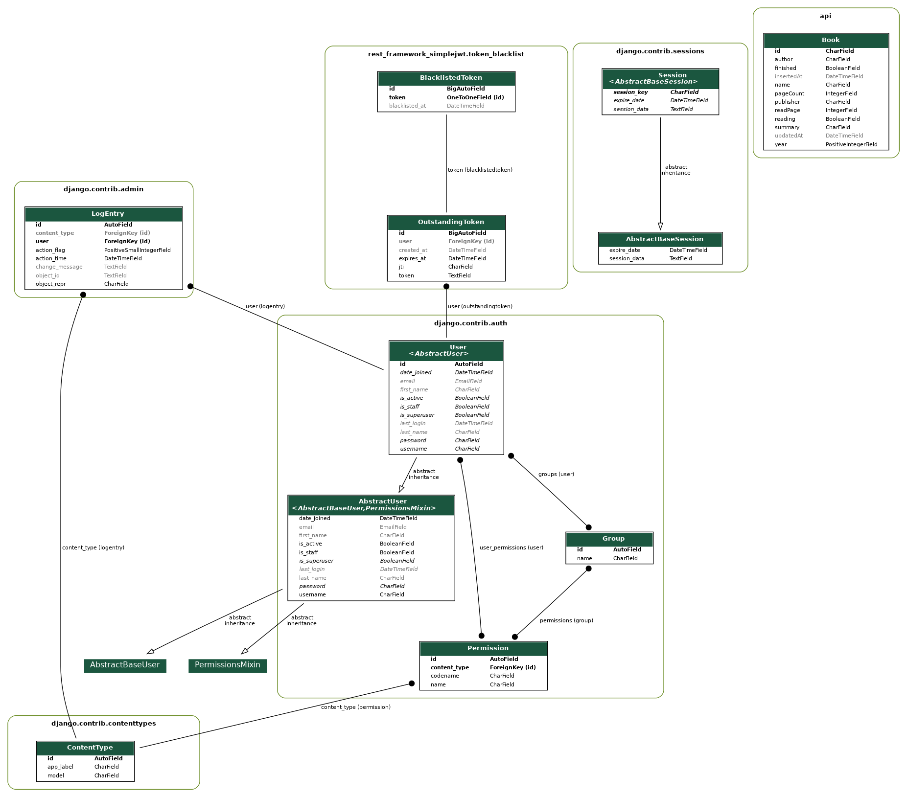
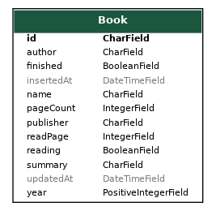

<div align="center" style="padding-bottom: 10px">
    <h1>BooksAPI</h1>
    
    
    
</div>

## Motivation behind this project and features:
This project was inspired by [Dicoding Final Project Backend API](https://dicoding.com). 
Initially I was finished the scholarship Dicoding Indonesia class of "Belajar Membuat Aplikasi Backend untuk Pemula". I got 5 stars for my final grade but it quickly came to an end and I was not satisfied with the end results.

### Description:
**REST API** with CRUD operations on books objects.
Users can send requests to API to view books anonymously. In order to create/update/delete books **JWT** is required. (Authorization: Bearer {token} attached to the headers). API provides endpoints for registration, token retrieval, change the password, update profile, and unauthorization token. I used black list as a log out functionality. The simple JWT blacklist app implements its outstanding and blacklisted token lists using two models: OutstandingToken and BlacklistedToken.

### Used Frameworks, libraries, tools:
- Django + Django REST Framework

**Json Web Token Authentication** is 'rest_framework_simplejwt' package, which provides JWT implementation including DRF views for obtaining and refreshing tokens.

### Tools:  
- Visual Studio Code, Postman

Production database is Heroku Postgres.
Postgres is also used by Github Actions where unit tests are ran.
Locally it used default SQLite database.

### Database schema:
ERD diagram including Django's base entities and manually created **Book** entity.


#### Book Model:


Book has its own name, author, publisher, etc.
It stores two datetime attributes: insertedAt and updatedAt which both are initially set on record's creation. 
Books are saved and updated using modified ModelSerializer.

### API Endpoints:
| HTTP Method | API endpoint            | Request body                                                                                                           | Response body                                                                                                                                           | Description                                                                    | Authorization header |
|-------------|-------------------------|---------------------------------------------------------------------------------------------------------------|---------------------------------------------------------------------------------------------------------------------------------------------------------|--------------------------------------------------------------------------------|----------------------|
| POST        | [api/auth/register/](https://books-api-dicoding.herokuapp.com/api/auth/register/)       | Object {<br> username: str,<br> password: str,<br> password2: str,<br> email: str,<br> first_name: str,<br> last_name: str<br>} | Object {<br> id: number,<br> username: str,<br> email: str,<br> first_name: str,<br> last_name: str<br>}                            | Creates new user. Returns simplified user object.                              | None                 |
| POST        | [api/auth/login/](https://books-api-dicoding.herokuapp.com/api/auth/login/)          | Object {<br> username: str,<br> password: str<br>} | Object {<br> refresh: str,<br> access: str<br>}                                                                                                         | Returns personal JWT access and refresh tokens.                                | None                 |
| POST        | [api/auth/login/refresh/](https://books-api-dicoding.herokuapp.com/api/auth/login/refresh/)  | Object {<br> refresh: str<br>}                     | Object {<br> access: str<br>}                                                                                                                           | Returns refreshed JWT access token.                                            | None                 |
| PUT         | [api/auth/password/{id}/](https://books-api-dicoding.herokuapp.com/api/auth/password/1/)                | Object {<br> password: str,<br> password2: str,<br> old_password: str<br>}                                    |                          X                         |Performs change on password with given ID. Returns updated password.        | Bearer {token}                    |
| PUT         | [api/auth/profile/{id}/](https://books-api-dicoding.herokuapp.com/api/auth/profile/1/)        | Object {<br>username: str,<br> first_name: str, <br> last_name: str, <br> email: str<br>}                 |                          X                         |Performs change on profile with given ID. Returns updated object.                                              | Bearer {token}                                       |
| POST        | [api/auth/logout/](https://books-api-dicoding.herokuapp.com/api/auth/logout/)   | Object {<br> refresh: str<br>}                       |                         X                          | Perform unauthorization user (logout).                                 | Bearer {token}                                       | 
| GET         | [api/books/](https://books-api-dicoding.herokuapp.com/api/books/)            |                          X                         | Array\<Object\> [<br> Object {<br>  id: str,<br>  name: str,<br> published: str<br>}<br>] | Lists all of the existing book objects.                                     | None                 |
| POST        | [api/books/](https://books-api-dicoding.herokuapp.com/api/books/)             | Object {<br> name: str,<br> year: number, <br> author: str, <br> summary: str, <br> publisher: str, <br>pageCount: number, <br>readPage: number, <br>}                     | Object {<br> bookId: str<br>}                                   | Creates and returns new book object with given content.                     | Bearer {token}       |
| GET         | [api/books/{id}/](https://books-api-dicoding.herokuapp.com/api/books/1)       |                          X                         | Object {<br> id: str,<br> name: str, <br> year: number,<br> author: str, <br>summary: str, <br> publisher: str, <br>pageCount: number, <br>readPage: number, <br> finished: boolean, <br>reading: boolean,<br>insertedAt: datetime,<br> updatedAt: datetime<br>}                                   | Retrieves book object with given ID.                                        | None                 |
| PUT         | [api/books/{id}/](https://books-api-dicoding.herokuapp.com/api/books/1)       | Object {<br> name: str,<br> year: number, <br> author: str, <br> summary: str, <br> publisher: str, <br>pageCount: number, <br>readPage: number, <br>}                     | X | Perfoms full update on book object with given ID. Returns updated object.| Bearer {token}       |
| DELETE      | [api/books/{id}/](https://books-api-dicoding.herokuapp.com/api/books/1)        |                          X                         |                                                                            X                                                                            | Deletes book object with given ID.                                          | Bearer {token}       |

Application also uses [Swagger](https://swagger.io/) for documentation purposes and 
also as a simpler and more visually appealing interface than individual REST Framework views.
You can see its main view at [homepage](https://books-api-dicoding.herokuapp.com/).

### Views:
There are 2 urls which need to be handled in REST type API.
One for listing objects and creating new ones and one for operating on a specific object such as list, update, and delete by id. 
Since in REST architecture there should no be endpoints such as `api/books/update/{id}`, `api/books/delete{id}` or anything like that, there is no need for creating a view for each CRUD operation.

**`ListCreateBook`** handles `api/books` endpoint. Allows GET, POST, and safe methods HEAD, OPTIONS. 
**`ListUpdateDeleteBookById`** handles `api/books/{id}` endpoint. ALlows GET, PUT, DELETE, and safe methods HEAD, OPTIONS.

### How to use this API:
Here are some examples how you can interact with API using different tools (curl, Python).  
Recommended using tool Postman.

Register yourself if you do not own an account.
``` shell script
curl -d "username=YourUserName&password=YourPassword" -X POST https://books-api-dicoding.herokuapp.com/api/auth/register/
```
Get your JWT token.
``` javascript
const request = fetch('http://127.0.0.1:8000/api/auth/token/', {
  method: 'POST',
  headers: {
    'Content-Type': 'Application/json'
  },
  body: JSON.stringify({
    username: 'YourUserName',
    password: 'YourPassword'
  })
}).then(res => res.json())
  .then(data => console.log(data));

const {refresh, access} = request;
```
If your token expires **(access token lives for 1 hours, refresh token - 24h)**
```javascript
const refresh = 'refresh token you previously redeemed or had stored';

const request = fetch('http://127.0.0.1:8000/api/auth/token/refresh/', {
  method: 'POST',
  headers: {
    'Content-Type': 'application/json'
  },
  body: JSON.stringify({
    refresh: refresh
  })
}).then(res => res.json())
  .then(data => console.log(data));

const { access } = request;
```
Now you can send requests to the API endpoints. Attach Authorization header if you want to POST/PUT/DELETE.
```python
import json
import requests

token = "your JWT access token"
headers = {
    'Authorization': f'Bearer {token}',
    'Content-Type': 'application/json' 
}

# get all books - no token needed
books = requests.get('http://127.0.0.1:8000/api/books/')
print(books.json())

# create new book
payload = json.dumps({
    'name': 'book-name',
    'year': 2021,
    'author': 'author-name',
    'summary': 'book-summary',
    'publisher': 'book-publisher',
    'pageCount': 400,
    'readPage': 0
})
new_book = requests.post('http://127.0.0.1:8000/api/books/',
    data=payload,
    headers=headers
)
new_book = new_book.json()

# get book - no token needed
bookid = new_book['data']['bookId']
book = requests.get(f'http://127.0.0.1:8000/api/books/{bookid}')
print(book.json())

# update book
payload = json.dumps({
    'name': 'book-name-updated',
    'year': 2022,
    'author': 'author-name-updated',
    'summary': 'book-summary-updated',
    'publisher': 'book-publisher-updated',
    'pageCount': 400,
    'readPage': 399
})
updated_book = requests.put(f'http://127.0.0.1:8000/api/books/{bookid}',
    data=payload,
    headers=headers
)
print(updated_book.json())

# delete book
delete_book = requests.delete(f'http://127.0.0.1:8000/api/books/{bookid}',
    headers=headers
)
print(delete_book.json())
```

### Testing:
All of API endpoints have their own unit tests.
This repository has its own Github workflows testing pipeline.
##### `api/books` tests:
- Get all books (empty list or few objects)
- Unauthorized POST request
- Not allowed method
- Create book: with valid content, invalid content such as: without name, readPage > pageCount.
- Get all books with specified query endpoint, currently only reading and finished Query endpoint.

##### `api/books/{id}` tests:
- Unaothorized PUT/DELETE
- Not allowd method
- Get/Update/Delete book: with valid content, invalid content such as: without name, readPage > pageCount, there's no id.

##### `api/auth/...` tests:
- Register new user, get token for them, refresh token (views from external packages are already tested by the authors)
- Update profile, change password, unauthorize user (logout), blacklist token and outstanding token.

### Deployment: 
This repository has been deployed to Heroku. You can visit [here](https://books-api-dicoding.herokuapp.com/)
#### Step to reproduce deployment:
1. Create staticfiles folder and put any file into it. 
(Make sure you made an exception in .gitignore for this file. Mine is called temp.)
2. Make sure there is Procfile is root directory with these 2 lines:  
``release: python manage.py migrate --no-input``  
``web: gunicorn core.wsgi``
3. Set `DEBUG = False`, add `django_heroku.settings(locals())` on the bottom of settings.py.
Make sure your **requirements.txt** contains every needed package. You may want to update it with
``pip freeze > requirements.txt``.
4. Go to [Heroku](https://dashboard.heroku.com/) and add new app.
5. Go to Resources tab and install **Heroku Postgres** add-on.
6. Go to Settings tab and set **SECRET_KEY** in config vars. Add **heroku/python** buildpack.
7. Go to Deploy tab, connect your Github repository, select branch to deploy.
You can Enable Automatic Deploys or Deploy Branch manually.
8. App should be up and running at ``https://<name_of_app>.herokuapp.com``.
### Local development:
Create new virtual environment, activate it and install dependencies.
```shell script
pip3 -m venv venv

. venv/bin/activate

pip install -r requirements.txt
```
Set **SECRET_KEY** in your environmental variables.  
You can also install `python-dotenv`, put `.env` file with secrets in root directory
and add those lines in settings.py. (Make sure .env is not being commited to git repository if you want to use this method)
```shell script
from dotenv import load_dotenv

load_dotenv()
```

Run migrations and create super user. (Making migrations might not be necessary)
```shell script
python manage.py makemigrations

python manage.py migrate  

python manage.py createsuperuser  
```
Run server and open your browser at `http://127.0.0.1:8000/`.
```shell script
python manage.py runserver
```
Run tests with coverage (unit tests + report)
```shell script
coverage run manage.py test

coverage report -m
```

### Possible future content:
- Permissions to access book (e.g only author can modify)
- More Query endpoint(get book by other attributes)
- Pagination (so that user would not receive everything at once)